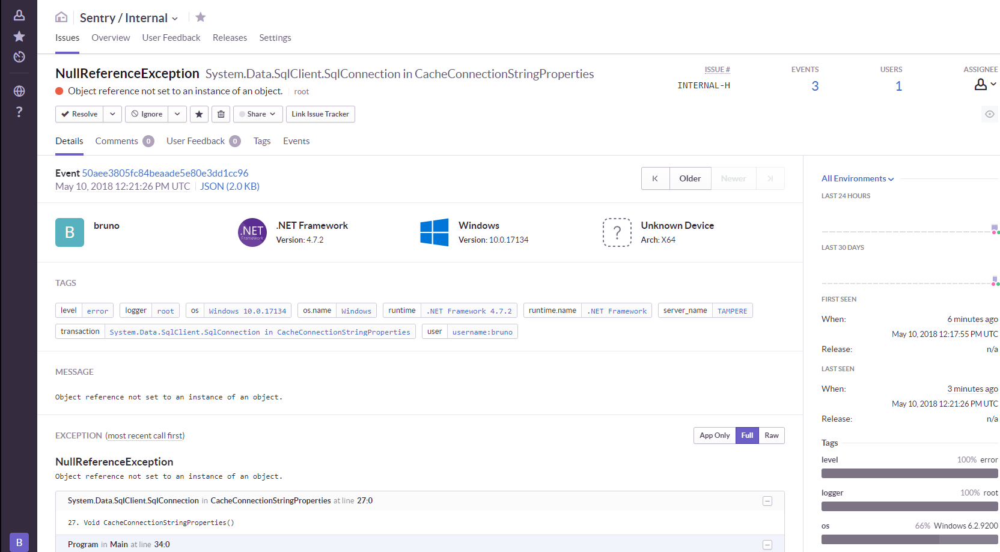

# SqlConnection bug in the .NET Framework 4.7.2

This repository contains a sample app that reproduces the issue introduced in the .NET Framework 4.7.2.

When executed, the `ConnectionString` property setter will throw a `NullReferenceException` which is captured by [Sentry](https://sentry.io/for/csharp/) using the [.NET SDK](https://github.com/getsentry/raven-csharp/).
To run it, you'll need a DSN. If you're new to Sentry, you can get one at [sentry.io](https://sentry.io/signup/?platform=c#).

## Run it

You can also run this without an IDE like Visual Studio if you have [.NET Core](https://www.microsoft.com/net/learn/get-started/windows) installed:
```shell
dotnet run -- "https://your-dsn@sentry.io"
> Sentry event Id: a5631eea6dec4b47a0eecaaf37d67c35
```
### Sentry will display such error as:

